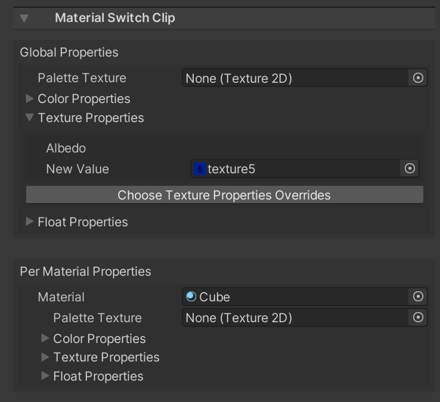

Material Switch User Documentation
==================================

# Overview
Material Switch allows you to change and blend between material parameters using Timeline.

# Requirements
1. [Selection Groups](https://docs.unity3d.com/Packages/com.unity.selection-groups@latest), 
   with data stored in the scene.   
   This is used to specify the set of renderers that have material parameters 
   we want to use in Timeline with a Material Switch clip. 

# Getting Started
1. In the timleline window, add a new Material Switch Track.   
2. The new track has an object field which you must change to the Selection Group you want to modify. All renderers and materials in this selection group can be used in the clips you will add to this track. You will manually choose which properties to use per clip in a later step.   
3. Add a new material switch clip to the track.   
4. The inspector window will show a number of options for modifying the clip. You can add values to override texture, color and float properties. In the next step, we will override a colour property.   
5. Open the Colour Properties foldout. Click the "Choose Color Properties Overrides" button, and a dropdown will appear with the available colour properties you can override. Choose a colour property.    
7. A new row appears in the foldout, with standard color picker. This allows you to set the override color.
8. Alternatively, you can use the Color Palette workflow. Assign a palette texture in the inspector. If the texture is not readable, a warning box will appear giving you the option to fix the texture settings with a single click.   
9. Now, instead of the standard color picker, there is a "Pick Color" button. If you click this button, the palette image will appear, allowing you to choose a new colour for the property.   
10. You can now play the clip, and see your colour changes take effect.

# Addendum:
New in version XX. There is now a section in the material switch clip editor named Global Properties.
This provides a single place to override all properties of the same name in the Per Material Properties. 
If the same  property is also overridden in the Per Material Properties section, it will take precedence over the global property. 
  

