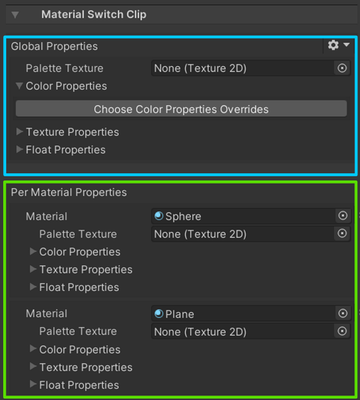

# Material Switch Clip 

The inspector of MaterialSwitchClip is used to override material properties of objects in the 
[Selection Groups](https://docs.unity3d.com/Packages/com.unity.selection-groups@latest) bound to the track, 
and it contains two sections:
1. The global properties section   
   To override the same properties of all materials related to the track with the same values.
2. The per material section  
   To override the material property of each material separately. 

Currently, we can override the following material properties:
1. Texture
2. Color
3. Float 

## Operations 

### Override a material property

Click one of the "Choose Property Overrides" buttons, and select one of the properties in the dropdown menu, 
which lists all available properties automatically.

The selected material property will then appear in the inspector, and assigning a custom value to it will 
override the material property without changing the original value.

### Remove a material property override 

To remove a material property override, simply click on the **X** button at the top right of the property.

### Copy and Paste Material properties.

The gears button at the top right of both sections contains items that can be used to copy the override values of the 
corresponding material properties and apply them to another material.

 

