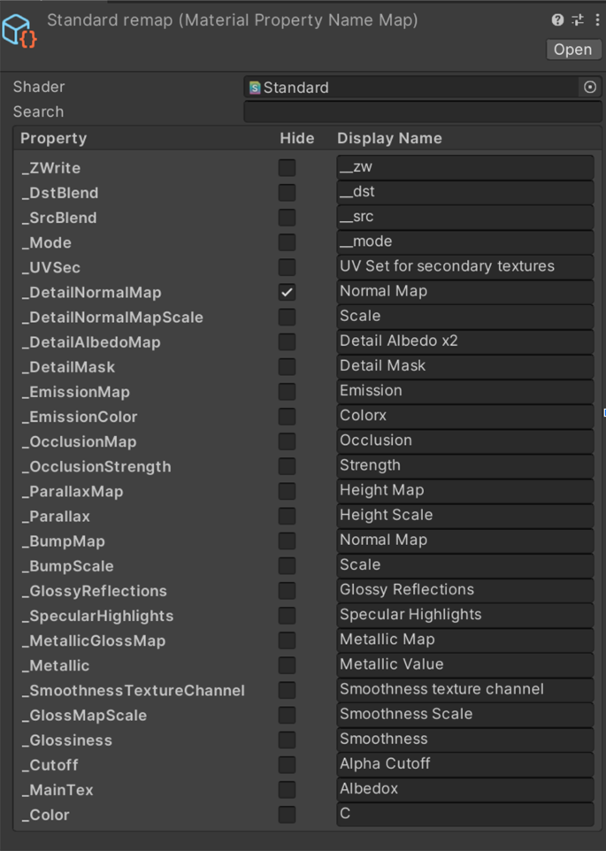

# Property Name Remap 

The property name remap tool is used to map technical property names to user friendly display names.

To create a new map, right click in the project window and choose Create -> Material Property Name Map.
This will create a new asset which you can select and edit using the inspector.

The shader field is used to create the list of the property names you wish to remap. In the above image,
the Standard shader has been selected. The list of property names is then populated from the shader. If you choose
a shader that already been used in a MaterialPropertyNameMap asset, a warning will be displayed.

Each property name can be hidden (not displayed in a MaterialSwitchClip override) and given a meaningful display name. This name is then used in a MaterialSwitchClip when choosing properties to override.

 

