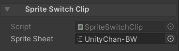
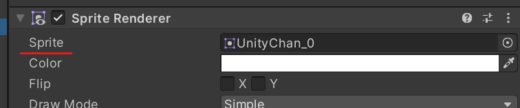
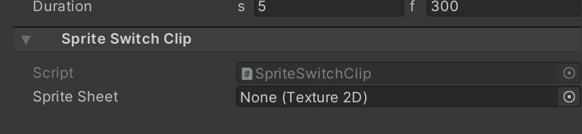

# Sprite Switch Clip 

The inspector of SpriteSwitchClip is used to override 
the sprites of [SpriteRenderer](https://docs.unity3d.com/Manual/class-SpriteRenderer.html) 
components in the [Selection Groups](https://docs.unity3d.com/Packages/com.unity.selection-groups@latest) bound to the track. 

## Operations

### 1. Create a selection group

The selection group must contain some gameobjects which have a sprite renderer component.

The sprite renderer has a sprite property which cannot be changed using the material-switch-clip, so a sprite-switch track is provided specifically for this purpose.

### 2. Create a sprite switch track

Using timeline, create a sprite switch clip track, then add a sprite switch clip. The initial clip will be empty. Next, assign another texture to the sprite sheet slot. When the timeline is playing, the base texture of the sprites will be changed to this new texture.

### 3. Please Note:
The sprite boundaries defined on the original spritesheet texture are always used, there is no need to define sprites on the second spritesheet texture.
